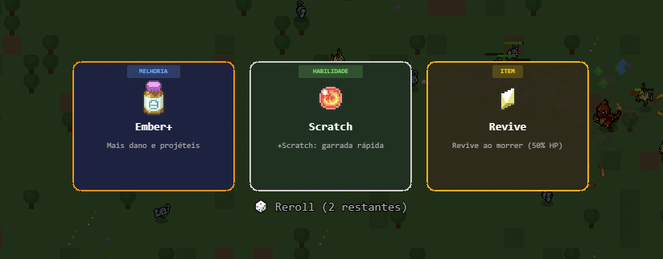
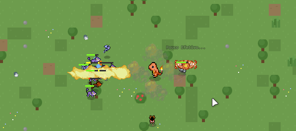

- Upei de level, e assim que upei dei um rerol, eu tinha 3, porém quando rolei 1x não cnsigo roletar mais mesmo tendo mais 2.

  -Ataque bugado, irmão veja o flamecharge, skilla ssim, ela tem que atacar TODO MUNDO que tiver no raio da skill, vai dar o dano 1x , porém não vai ser no primeiro e sim em todo mundo, qual o sentido dessa skill não sera ssim? 

  -Flood de mensagens quando atacado em muitos proximos, isso fica meio feio 

  - Nas ondas de pokemons que causam confusaõ diminuir a quantidade deles, priorizar outros tipos de inimigos, além disso vai diminuir o tamanho do ataque, e em 10% a velocidade de ataque e movimento, nerfe em 5% o coldown do ataque

  - Quando estou comendo alguma fruta ou então, quando acaba o buff de speed o personagem esta ficando  com a skin azulada.

  - Diminuir tamanho dos itens dropados, um exemplo a berry  de 25 , esta muito grande.

  - Os items lá embaixo, deve ser possivel passar o mouse em cima deles para ver o que dão.

  - Não esta sendo possivel comprar itens na loja, além disso não estão aparecendo os icones deles na loja.