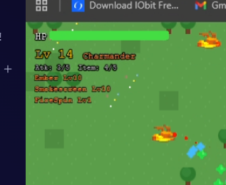
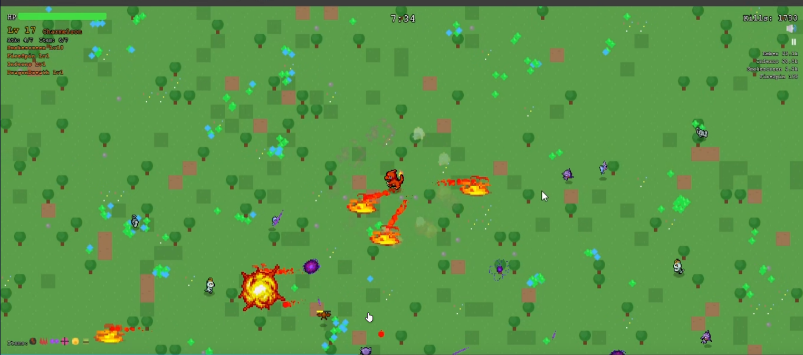

  - Bug, arbok a poça de veneno, não ta causando veneno, outro bug, um amigo, conseguiu pegar level 10 com o smokescreen e com o ember. Temos um limite? se sim, nem com os upgrade skills e etc, é para poder passar do nivel maximo.
  
 Outro amigo disse que estava com ()
  - O usuario falou que o jogo começou a travar, e ele estava assim Com smoekscreen, inferno, flametorwser, flarerush e fireblast e estava lagando
  .

  - Em alguns casos, quando for upar de nivel ou upgrade o jogo continua rodando por baixo dos panos, "skills sendo jogadas", monstros andando e etc.

- Em pcs com telas menores o zoom do mapa tera de ser menor. As arvores de fruta"que dropam vida" deve aparecer com mais frequencia no jogo. OS POKEMONS por padrão devem vir com + 30 de vida e com + 3 de regen base.

  - Nerfar confuse, ser mais lento as speels e não seguir. Quando o usuario tomar 1 confuse, ele vai ter um coldown de 3 segundos para tomar outro

  - Os pokemons tem hora que ficam muito juntos de um lado só, igual o vampire survivors se tem muitos inimigos na esquerda e eal some do seu campo de visao, eles vão começar a aparecer dos outros lados do mapa.

  - Teremos que reformular alguns ataques para terem ricochetes como o "water gun ou bubble" pois esta dificil de matar muitos pokeons juntos.
  - Pokemons projeteis como gastly terão de vir com menos frequencia, e geralment teremos mais pokemons tanks, sem atirar.
  - Por fim, aos 2 minutos vai virum circiculo lotado de ratata, ele vai tipo um circulo ao redor do pokemon.

  - Muitos estão falando que charmander esta extremamente mais forte que o squirtle "squirtle" não tem dano. Ou seja, o foco dele é projetil teremos que trazer mais um pouco de ricochetes ou ataques que explodem dano em area.

 - O icone de fruta para healar, vai ser um leaftovers, mas pegue outras berrys para colocarmos lá, algumas curarão mais vida, e poderão dar buffs do tipo, 2x de ataque por 30 segundos por ai vai. 

  - Mude o ICONE da parte de "items" que fica la embaixo para os icones corretos das coisas.