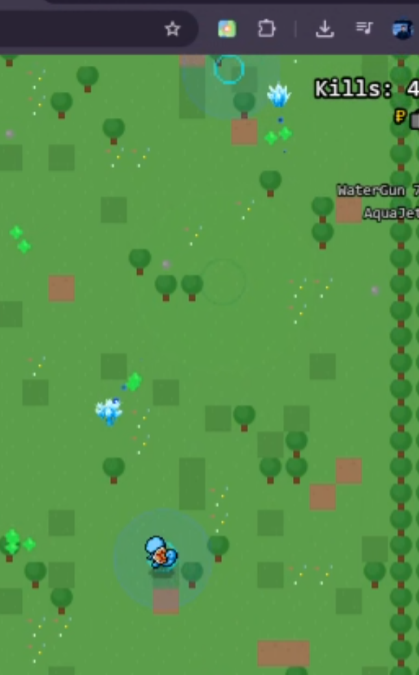
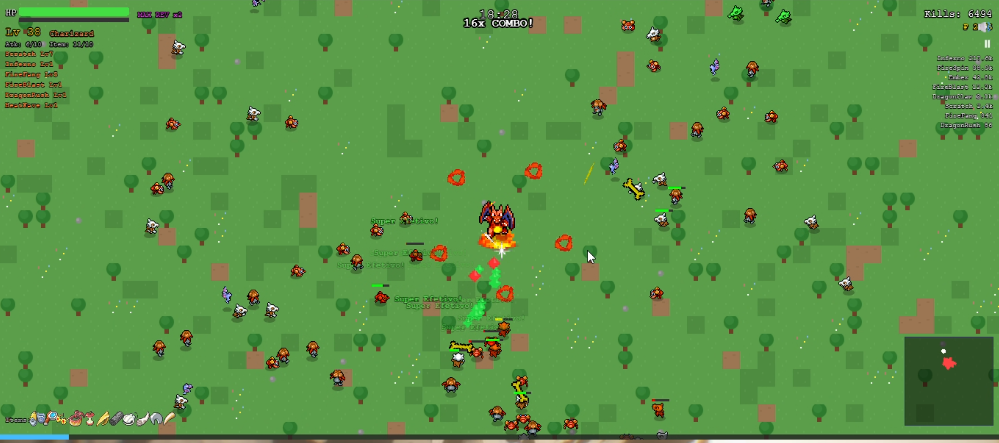

- As vezes ao passar em cima da pokebola vermelha normal, naõ acontece nada. (Ouvi boatos que algumas pokebolas não funcionam)

- Gastly depois que é morto e ja tenha jogado uam skill, ela não da dano.

- Deixar a parte de dinheiro do lado esquerdo de kills.

- WithDraw quando é ativado, fica no lugar no chao 

- Outro bug, no jogo do meu amigo, ele estava com 30 minuos e não tinha aparecido o snorlax ainda.
- Nerf no snorlax, ele esta regenrando muita vida, muito rapido. Regen tem que ser diminuido, ele vai ter a ahbilidade rest. caso ja tenha, nerfe em 80%.
Tem que mostrar o range da habilidade dele d quando ele dar o pulão no chão e nerfar um pouco.

- GANHO DE dinheiro no facil ser mais dificil que no facil 90% e medio 50%

- O JOGADOR MORREU E TRAVOU A TELA DE GAME OVER! [alt text](bug/Discord_2v3FpSAsdK.png)

- Beedril tem resistencia a 70% de ataques "spin", fire spin e etc. E ataques auras tambem
- Os bosses vão ter resistencia a ataques spins. Todos eles
- Todos os ataques em area do boss, devem mostrar a area dele, exempl o snorlax pulando e batendo no chão vai mostrar a area

- Quando o cara vai upar de lvel ,exemplo 35 pro 36, aparece alguns itens, mas quando evolui ele reseta a lista de itens.

- Bug do nada o jogo travou  (index-B5Iba8Tf.js:6369 Uncaught TypeError: Cannot read properties of undefined (reading 'setVelocity')
    at An.charge (index-B5Iba8Tf.js:6369:124303)
    at initialize.callback (index-B5Iba8Tf.js:6369:122777)
    at initialize.update (index-B5Iba8Tf.js:5891:2060)
    at C.50792.n.emit (index-B5Iba8Tf.js:1:2913)
    at initialize.step (index-B5Iba8Tf.js:5034:786)
    at initialize.update (index-B5Iba8Tf.js:5021:3225)
    at initialize.step (index-B5Iba8Tf.js:466:1768)
    at initialize.step (index-B5Iba8Tf.js:470:2773)
    at e (index-B5Iba8Tf.js:1036:186))